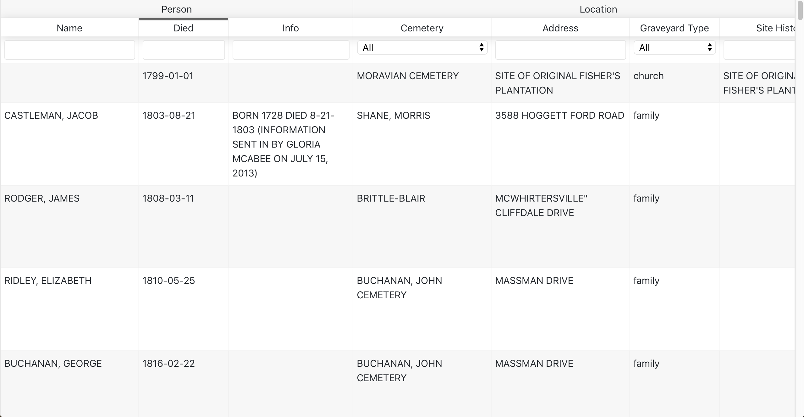

# NashGravePlot

Web app to view cemetery information for Nashville, Tennessee. Data
comes from [Davidson County Cemetery Survey](https://data.nashville.gov/Geneology/Davidson-County-Cemetery-Survey/ttqg-mpiz).



### How to develop

I'm using node 8.11.3 and npm 6.8.0 on macOS.

```bash
npm install
npm start
```

To deploy GitHub Pages site, first modify [package.json](./package.json) to
change the `homepage` field based on your GitHub URL, then:

```bash
npm run deploy
```
