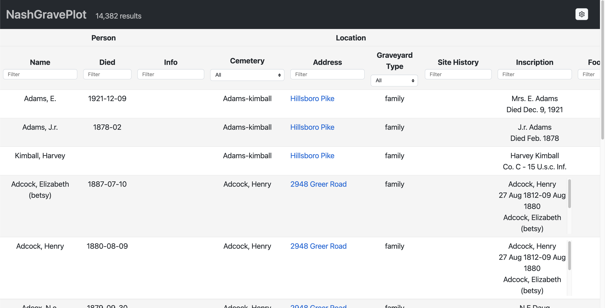

# NashGravePlot

Web app to view cemetery information for Nashville, Tennessee. Data
comes from [Davidson County Cemetery Survey](https://data.nashville.gov/Geneology/Davidson-County-Cemetery-Survey/ttqg-mpiz).



## How to develop

I'm using node v19.1.0 and npm 8.19.3 on macOS.

```bash
npm install
npm start
```

To deploy GitHub Pages site, first modify [package.json](./package.json) to
change the `homepage` field based on your GitHub URL, then:

```bash
npm run deploy
```

## Thanks

Thank you to the folks behind these great tools and libraries:

- [Nashville Open Data Portal](https://data.nashville.gov/) - for providing the data
- [react-responsive-masonry](https://github.com/cedricdelpoux/react-responsive-masonry) - for the photo gallery
- [React Table](https://tanstack.com/table/v8)
- [React Router](https://reactrouter.com/en/main)
